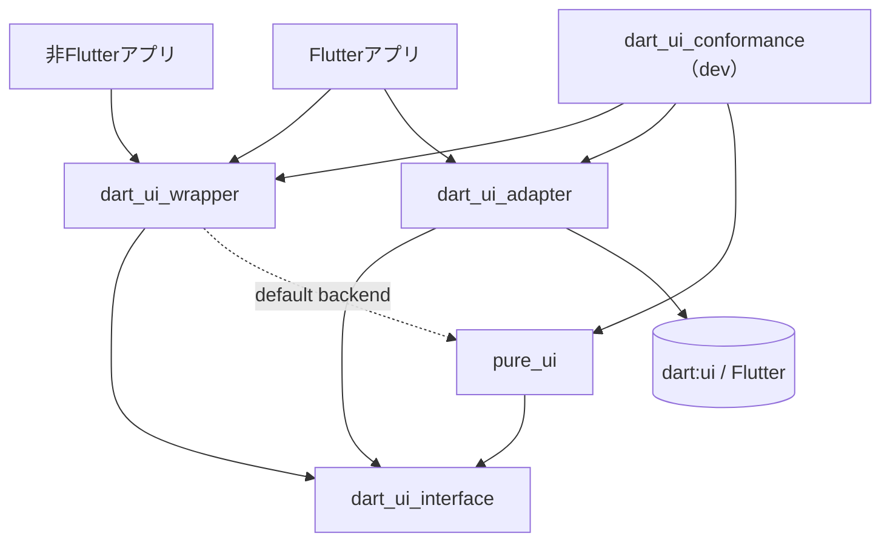

# 計画書: `dart:ui` / `pure_ui` 切り替え可能アーキテクチャ

> 本書は Claude Code に実装を依頼するための設計仕様 兼 作業計画書です。
> パッケージ名・型名は提案です。`§命名` で一括変更できるよう、抽象名で記述しています。

---

## 0. 概要と前提

### 0.1 ゴール
- `dart:ui` を使う既存コードを、**import を変えずに** `pure_ui` / `dart:ui` で切り替えられるようにする。
- 切り替えは import の差し替えではなく、**1つの backend インスタンスを差し替えるだけ**で行う。
- 切り替えは可能なら**実行時(ランタイム)**に行える。

### 0.2 現状
- `pure_ui`: Flutter 非依存の `dart:ui` 再実装(既存)。
- `dart:ui`: Flutter エンジン提供。**改修不可能**。

### 0.3 用語
| 用語 | 意味 |
|---|---|
| backend | 実際の描画実装(`dart:ui` か `pure_ui`)を提供する差し替え可能な実体 |
| インターフェース層 | backend が満たすべき契約(抽象型・enum・値型) |
| アダプタ | 既存実装をインターフェースに適合させる薄いラッパ |
| facade | ユーザーが import する公開 API 表面 |

---

## 1. 重要な設計判断(先に結論)

実装に入る前に、ここを誤ると後で全面手戻りになる論点を先に確定させます。

### 1.1 【最重要】`dart:ui` 用アダプタが必須 — ライブラリは実質3〜4個
当初案の「インターフェース」+「wrapper」だけでは不足します。

- `dart:ui` の `Paint` / `Canvas` 等は **engine 提供の具象クラスで、後付けで interface を `implements` させられない**。
- したがって `dart:ui` の型を interface に適合させる **アダプタ層(別パッケージ)が必須**。
- `pure_ui` 側は自分のコードなので、interface を直接 `implements` させられる(アダプタ不要にできる)。

→ 結果として最低限 **3パッケージ**(interface / wrapper / dart:ui アダプタ)、構成によっては4パッケージになります。

### 1.2 【最重要】wrapper を Flutter 非依存に保つ
`pure_ui` の存在意義は「Flutter 無し環境(CLI・サーバ・headless・golden test)で動くこと」です。
- もし wrapper が `dart:ui` アダプタを**静的 import** すると、wrapper 自体が Flutter 依存になり、非 Flutter 環境でロードできなくなる(本末転倒)。
- よって **wrapper は interface(+デフォルトの pure_ui)にのみ依存**し、`dart:ui` アダプタは**アプリ側がオプトインで依存**して DI で注入する構造にする。

```
非Flutterアプリ → wrapper(default: pure_ui) のみ。dart:ui は存在し得ないので切替不要。
Flutterアプリ   → wrapper + dart_ui_adapter を依存に追加し、起動時に backend を差し替え。
```

ランタイム切り替えで「dart:ui と pure_ui を同一プロセス内で行き来」できるのは、両方ロード可能な **Flutter コンテキストのみ**。これは制約ではなく自然な帰結(非 Flutter では dart:ui がそもそも無い)。

### 1.3 値型(Offset/Rect/Color 等)はインターフェース層に**具象**で一度だけ定義する
`Offset` / `Size` / `Rect` / `RRect` / `Radius` / `Color` 等は engine リソースを持たない**純粋なデータ**です。

- これらを抽象型 + factory ディスパッチにすると **`const Offset.zero` 等の `const` 利用が壊れる**(コンパイル不能)。既存 dart:ui コードは const を多用するため致命的。
- よって値型は **interface 層に concrete クラスとして1回だけ実装**し、`const` コンストラクタを温存する。
- backend へ渡す境界でのみ変換する(下記)。

→ **factory ディスパッチ(backend 振り分け)の対象はリソース保持型のみ**: `Paint` `Path` `Canvas` `PictureRecorder` `Picture` `Image` `Shader` `*Filter` `Paragraph*` など。

### 1.4 「型は1階層」にして二重ラップを避ける
ディスパッチ用の factory コンストラクタを持つ抽象型と、backend が `implements` する契約型を**同一の型(interface 層に置く)**にする。

- factory を wrapper 側に置くと、契約型(interface)と公開型(wrapper)が分離し、毎オブジェクトを二重ラップ or 循環依存が発生する。
- よって **公開抽象型(`Paint` 等)+ factory コンストラクタ + 契約(抽象メンバ)を interface 層に集約**し、wrapper は **re-export とライフサイクル管理に徹する**。(詳細 §3.4)

### 1.5 「ピクセル完全一致」は目標にしない
backend が違えばアンチエイリアス・フォントラスタライズ・サブピクセル処理が異なり、**出力は微差が出る**のが普通。
- 保証するのは「**API 互換 + 視覚的に同等**」まで。
- golden test は backend 別に golden を持つ or 許容誤差を設ける(§7)。

---

## 2. パッケージ構成と依存関係

### 2.1 パッケージ一覧

| パッケージ(提案名) | 役割 | Flutter 依存 |
|---|---|:---:|
| `dart_ui_interface` | 契約: `UiBackend`、公開抽象型(factory 付き)、値型(具象)、enum、変換 hook | ✗ |
| `dart_ui_wrapper` | facade(re-export)、backend ライフサイクル/切替 API、デフォルト backend 配線 | ✗ |
| `dart_ui_adapter` | `dart:ui` を interface に適合させるアダプタ + `DartUiBackend` | ✔ |
| `pure_ui`(既存改修) | interface を**直接実装**(推奨)し `PureUiBackend` を提供 | ✗ |
| `dart_ui_conformance`(dev) | 両 backend に同一テストを流す適合性テスト群 | テスト時のみ✔ |

> `pure_ui` を interface に直接依存させたくない場合は、別途 `pure_ui_adapter` を1枚挟む構成も可(疎結合 ↔ 変換オーバーヘッドのトレードオフ。推奨は直接実装)。

### 2.2 依存方向(循環厳禁)



ポイント:
- `interface` は依存の最下層、Flutter 非依存。
- `wrapper` はデフォルト backend として `pure_ui` を持つが Flutter には触れない。
- Flutter 依存は `dart_ui_adapter` だけに**隔離**。
- アプリは「どの backend を依存に入れるか」を選ぶ。

### 2.3 ディレクトリ構成(モノレポ / melos 推奨)

```
repo/
  melos.yaml
  packages/
    dart_ui_interface/
      lib/
        dart_ui_interface.dart        # 公開バレル(re-export)
        src/
          backend.dart                # UiBackend, instance, Zone override
          values/                      # Offset, Size, Rect, RRect, Radius, Color ...(具象)
          enums/                       # BlendMode, PaintingStyle, ...
          painting/                    # Paint, Path, Canvas, PictureRecorder, Picture ...(抽象+factory)
          text/                        # Paragraph*, TextStyle, ...(抽象+factory)
          image/                       # Image, Codec, FrameInfo ...(抽象+factory)
          functions.dart               # lerpDouble, decodeImageFrom*, ...(backend 委譲)
    dart_ui_wrapper/
      lib/
        ui.dart                        # `as ui` で dart:ui 置換できる単一バレル
        dart_ui_wrapper.dart           # 切替 API + デフォルト配線
    dart_ui_adapter/
      lib/
        dart_ui_adapter.dart           # DartUiBackend + 各アダプタ + 値型変換
        src/conv/                       # ui.Offset <-> Offset 等の変換
    pure_ui/                            # 既存。interface 実装 + PureUiBackend を追加
    dart_ui_conformance/
      test/                            # 両 backend 共通テスト
```

---

## 3. 切り替え機構の設計

### 3.1 `UiBackend`(interface 層)
backend が満たすべきファクトリ契約。**リソース保持型の生成口**を集約する。

```dart
abstract interface class UiBackend {
  // --- painting ---
  Paint createPaint();
  Path createPath();
  PictureRecorder createPictureRecorder();
  Canvas createCanvas(PictureRecorder recorder, [Rect? cullRect]);

  // --- shaders / filters ---
  Gradient createLinearGradient(Offset from, Offset to, List<Color> colors,
      [List<double>? stops, TileMode tileMode, Float64List? matrix4]);
  Gradient createRadialGradient(/* ... */);
  Gradient createSweepGradient(/* ... */);
  Shader createImageShader(Image image, TileMode tmx, TileMode tmy, Float64List matrix4,
      {FilterQuality? filterQuality});
  ColorFilter createColorFilterMode(Color color, BlendMode blendMode);
  // matrix/linearToSrgbGamma など他の ColorFilter ファクトリも同様
  ImageFilter createBlurFilter({double sigmaX, double sigmaY, TileMode tileMode});
  // ...

  // --- text ---
  ParagraphBuilder createParagraphBuilder(ParagraphStyle style);
  ParagraphStyle createParagraphStyle({/* dart:ui と同一引数 */});
  TextStyle createTextStyle({/* ... */});
  StrutStyle createStrutStyle({/* ... */});

  // --- image / async ---
  Future<Codec> instantiateImageCodec(Uint8List list,
      {int? targetWidth, int? targetHeight, bool allowUpscaling});
  Future<Image> decodeImageFromPixels(/* ... */);
  // ...
}
```

### 3.2 backend の保持と切替 + Zone スコープ
グローバル可変状態の危険(テスト・並行)を抑えるため、**グローバル既定 + Zone オーバーライド**の二段構え。

```dart
abstract interface class UiBackend {
  static UiBackend? _global;

  /// 現在の backend。Zone 上書きがあればそれを優先。
  static UiBackend get instance {
    final zoned = Zone.current[#dartUiBackend];
    if (zoned is UiBackend) return zoned;
    final g = _global;
    if (g == null) {
      throw StateError(
        'UiBackend 未登録です。dart_ui_wrapper を import するか '
        'UiBackend.instance = ... で backend を設定してください。',
      );
    }
    return g;
  }

  /// グローバル切替(アプリ起動時に1回など)。
  static set instance(UiBackend backend) => _global = backend;

  /// スコープ限定切替(テストやネスト用。並行安全)。
  static T runWith<T>(UiBackend backend, T Function() body) =>
      runZoned(body, zoneValues: {#dartUiBackend: backend});
}
```

利用イメージ:
```dart
// Flutterアプリ起動時
UiBackend.instance = DartUiBackend();      // dart:ui へ
// or
UiBackend.instance = PureUiBackend();      // pure_ui へ

// golden test を pure_ui で隔離実行
UiBackend.runWith(PureUiBackend(), () {
  // この中の Paint()/Canvas()/... は全て pure_ui で生成される
});
```

### 3.3 公開抽象型 + factory ディスパッチ
ユーザーが書く `Paint()` / `Canvas(recorder)` を現在 backend に振り分ける。**抽象クラスの factory コンストラクタ**で実現。

```dart
abstract class Paint {
  factory Paint() => UiBackend.instance.createPaint();

  Color get color;          set color(Color value);
  PaintingStyle get style;  set style(PaintingStyle value);
  double get strokeWidth;   set strokeWidth(double value);
  StrokeCap get strokeCap;  set strokeCap(StrokeCap value);
  BlendMode get blendMode;  set blendMode(BlendMode value);
  bool get isAntiAlias;     set isAntiAlias(bool value);
  Shader? get shader;       set shader(Shader? value);
  // ... dart:ui.Paint の全 getter/setter を網羅 ...
}

abstract class Canvas {
  factory Canvas(PictureRecorder recorder, [Rect? cullRect]) =>
      UiBackend.instance.createCanvas(recorder, cullRect);

  void drawRect(Rect rect, Paint paint);
  void drawRRect(RRect rrect, Paint paint);
  void drawPath(Path path, Paint paint);
  void drawImage(Image image, Offset offset, Paint paint);
  void drawParagraph(Paragraph paragraph, Offset offset);
  void save(); void restore(); void translate(double dx, double dy);
  void transform(Float64List matrix4);
  // ... dart:ui.Canvas の全メソッドを網羅 ...
}
```

> `..color = ...` のカスケードは setter があるため成立。`Paint()` の戻り値は backend 別の具象(`DartUiPaint` / `pure_ui.Paint`)で、どちらも `Paint` を `implements`。

### 3.4 なぜ型を interface 層に置くか(§1.4 の根拠)
- backend(`pure_ui` / `dart_ui_adapter`)は `Paint` を `implements` する必要がある。
- もし `Paint` が wrapper にあると、backend → wrapper → (default)pure_ui → … と循環/二重ラップが発生。
- `Paint`(抽象+factory)を **interface 層に置けば**、backend は interface のみ依存で実装でき、循環しない。
- wrapper は単に re-export するだけ。
- `pure_ui` の具象 `Paint` は interface の `Paint` を `implements` するが、**公開されるのは pure_ui の具象型**(実コンストラクタ)であり、interface の factory ディスパッチ型ではない。これにより「pure_ui 単体 drop-in」と「backend としての差し込み」を両立する(詳細 §6.0)。

### 3.5 アダプタの実装パターン(wrap / unwrap)

**dart:ui 側(変換あり)**
```dart
// dart_ui_adapter
import 'dart:ui' as ui;
import 'package:dart_ui_interface/dart_ui_interface.dart';

class DartUiPaint implements Paint {
  final ui.Paint raw = ui.Paint();
  @override Color get color => raw.color.toInterface();
  @override set color(Color v) => raw.color = v.toUi();
  @override set style(PaintingStyle v) => raw.style = v.toUi();   // enum マップ
  // ...
}

class DartUiCanvas implements Canvas {
  final ui.Canvas raw;
  DartUiCanvas(this.raw);
  @override
  void drawRect(Rect rect, Paint paint) =>
      raw.drawRect(rect.toUi(), (paint as DartUiPaint).raw);   // 値型変換 + unwrap
}

class DartUiBackend implements UiBackend {
  @override Paint createPaint() => DartUiPaint();
  @override Canvas createCanvas(PictureRecorder r, [Rect? cull]) =>
      DartUiCanvas(ui.Canvas((r as DartUiPictureRecorder).raw, cull?.toUi() ?? _defaultCull));
  // ...
}
```

**pure_ui 側(直接実装・変換ゼロ)**
```dart
// pure_ui（interface の値型・enum をそのまま使うよう改修）
class Paint implements interface.Paint { /* 既存実装をそのまま契約に合わせる */ }
class PureUiBackend implements UiBackend {
  @override interface.Paint createPaint() => Paint();
  @override interface.Canvas createCanvas(/* ... */) => Canvas(/* ... */);
}
```

→ **pure_ui 経路は変換オーバーヘッド ≒ 0、dart:ui 経路のみ境界変換コスト**。この非対称は意図的(§8)。

---

## 4. API サーフェス・インベントリ(網羅)

`dart:ui` の `painting` / `text` / `painting`系を対象。**プラットフォーム/ウィンドウ/セマンティクス系は対象外**(pure_ui の責務外)。

### 4.1 値型(interface 層に具象・`const` 温存) — §1.3
`Offset` / `Size` / `Rect` / `RRect` / `Radius` / `RSTransform` / `Color`
- 純データ。1回実装。backend へは境界で変換(dart:ui のみ)。
- `Color` は wide-gamut 対応(`Color.from`, `colorSpace`, `withValues`)を含むか、対象 Flutter 版に合わせて要確認(§11)。

### 4.2 enum(interface 層で定義、アダプタで明示マッピング)
`BlendMode` `PaintingStyle` `StrokeCap` `StrokeJoin` `BlurStyle` `FilterQuality` `Clip` `ClipOp` `PathFillType` `PathOperation` `VertexMode` `PointMode` `TileMode` `ImageByteFormat` `PixelFormat` `FontStyle` `FontWeight`(class) `TextAlign` `TextBaseline` `TextDirection` `TextDecoration`(class) `TextDecorationStyle` `TextLeadingDistribution` `TextAffinity` `BoxHeightStyle` `BoxWidthStyle` `PlaceholderAlignment`

> ⚠ **index 一致を仮定せず、switch / マップで明示変換**。バージョン間で順序が変わるリスクがあるため。

### 4.3 リソース保持型(抽象+factory、backend が実装) — ディスパッチ対象
| 分類 | 型 |
|---|---|
| 描画 | `Paint` `Path` `PathMetric(s)` `Tangent` `Canvas` `PictureRecorder` `Picture` `Vertices` |
| 画像 | `Image` `Codec` `FrameInfo` `ImageDescriptor` `ImmutableBuffer` |
| シェーダ/フィルタ | `Shader` `Gradient` `ImageShader` `ColorFilter` `ImageFilter` `MaskFilter` `FragmentProgram` `FragmentShader` |
| テキスト | `ParagraphBuilder` `ParagraphStyle` `TextStyle` `StrutStyle` `Paragraph` `LineMetrics` `TextBox` `GlyphInfo` `FontFeature` `FontVariation` |

### 4.4 トップレベル関数(wrapper で同名公開、backend 委譲 or 純計算)
`lerpDouble` `clampDouble`(純計算 → interface で実装) /
`instantiateImageCodec` `decodeImageFromList` `decodeImageFromPixels`(backend 委譲)

### 4.5 対象外(明示的に非対応)
`PlatformDispatcher` `FlutterView` `window` `Display` `ViewConfiguration` `SemanticsUpdate(Builder)` `PointerData*` `KeyData` `ChannelBuffers` 等。
- 必要になったら別途検討。`Locale` はテキスト用に最小限必要なら interface 側へ。

### 4.6 ライフサイクル(dispose / clone)
`Picture` `Image` `Paragraph` 等は `dispose()` / ref-count(`Image.clone`, `debugDisposed`)を持つ。**契約に dispose を含め**、アダプタは委譲、pure_ui も同セマンティクスを保証。

---

## 5. カテゴリ別 実装方針

| カテゴリ | interface 層 | dart:ui アダプタ | pure_ui |
|---|---|---|---|
| 値型 | 具象実装(const 温存) | `toUi()/toInterface()` 変換 extension | interface 型を直接採用 |
| enum | 定義 | 明示 switch マッピング | interface enum を採用 |
| 描画(Paint/Path/Canvas) | 抽象+factory | wrap/unwrap アダプタ | 直接 implements |
| 画像/codec(async) | 抽象+factory + 委譲関数 | engine API 委譲 | 自前デコーダ委譲 |
| シェーダ/フィルタ | 抽象+factory | engine 委譲 | 対応範囲のみ実装 |
| FragmentProgram/Shader | 抽象+factory | engine 委譲(asset/SPIR-V) | **未対応なら `UnsupportedError`** |
| テキスト(Paragraph系) | 抽象+factory | engine 委譲 | レイアウトエンジン委譲 |

未対応機能の指針: **黙って no-op にせず `UnsupportedError` を投げる**(差異を早期検出するため)。`backend.supports(feature)` のような capability 照会 API を用意してもよい。

---

## 6. 既存コードの移行戦略

### 6.0 【重要】`pure_ui` 単体の drop-in 互換は維持する(3モード共存)

実装後も、`pure_ui` は **import を差し替えるだけの `dart:ui` 互換**を従来どおり保つ。リファクタ(interface 実装化)は「`pure_ui` が interface を `implements` するだけ」であって、`pure_ui` 単体での使い方を変えない。

実装後は次の **3つの使い方が共存**する:

| モード | import | 切替機構 | backend 設定 |
|---|---|:---:|:---:|
| 従来 Flutter | `import 'dart:ui'` | — | 不要 |
| **pure_ui 単体(drop-in)** | `import 'package:pure_ui/pure_ui.dart'` | **import 差替のみ** | **不要** |
| backend 切替 | `import 'package:dart_ui_wrapper/ui.dart'` | インスタンス差替 | 必要(default は pure_ui) |

#### 互換を成立させる設計ルール(必須)

> **`pure_ui` は自前の具象型(実コンストラクタを持つ型)を公開し続ける。interface 側の factory ディスパッチ型は公開しない(`implements` するだけ)。**

- `import 'package:pure_ui/pure_ui.dart'` で `Paint()` を呼ぶと、**pure_ui の paint を直接生成**する。`UiBackend.instance` には一切触れないため、backend 未設定でも単体で動作し、import 差替だけの drop-in 性が保たれる。
- `pure_ui` の公開シンボル名は `dart:ui` と同名・同 API を維持する(interface が dart:ui を写像しているので、pure_ui がそれに準拠する限り自動的に整合する)。
- 値型(`Offset` / `Color` / `Rect` 等)は interface 層へ移動するが、`pure_ui` がそれらを **re-export** する。全 backend で同一型になり、かつ dart:ui と同名なので互換に影響しない。

#### やってはいけないこと(互換を壊す典型)

- ❌ `pure_ui` が **interface 側の抽象型(`factory Paint() => UiBackend.instance.createPaint()` を持つ型)を公開**してしまう。
  → `import pure_ui; Paint()` が backend ディスパッチ経由になり、backend 未設定で例外/別実装に飛び、単体 drop-in が壊れる。
- ❌ リファクタ過程で公開シンボル名を変更・名前空間化する。

> 補足: §6.3 の「`import 'dart:ui'` 直接使用禁止」の CI ガードは **wrapper へ移行したコードに対する規約**であり、`pure_ui` を単体利用する側には適用されない。

#### 退行防止
- `pure_ui` の公開 API が `dart:ui` と整合し続けることを検証する **drop-in 回帰テスト**を追加(公開シンボル一覧の差分検査 + 代表コードが import 差替のみでビルド・動作すること)。

### 6.1 import 置換(一度きり)
```dart
// before
import 'dart:ui' as ui;
// after
import 'package:dart_ui_wrapper/ui.dart' as ui;
```
- `ui.dart` は **`dart:ui` と同名のシンボルを re-export** するため、原則 import 行のみの変更でビルドが通る状態を目標にする。
- 以後 backend 切替は import を触らず `UiBackend.instance = ...` だけ。

### 6.2 互換ギャップの洗い出し
- 移行対象コードが使う dart:ui シンボルを静的解析で抽出 → interface 未カバー分をリスト化 → 優先実装。
- 完全互換が難しい API(FragmentShader 等)は移行ガイドに代替策を明記。

### 6.3 退行防止ガード(CI)
- 移行済みパッケージで `import 'dart:ui'` の直接使用を **custom lint or CI grep で禁止**(バックエンドを迂回されないように)。例外は `dart_ui_adapter` のみ許可。

### 6.4 段階移行
ファイル単位 / パッケージ単位で `ui.dart` へ切替 → conformance test green を確認しながら拡大。

---

## 7. テスト戦略

### 7.1 適合性テスト(parity)— 中核
`dart_ui_conformance` に **backend 非依存の同一テスト**を置き、`PureUiBackend` と `DartUiBackend` の両方で実行(`UiBackend.runWith`)。
- 各 API の戻り値・例外・状態遷移が両 backend で一致することを検証。
- ライフサイクル(dispose 後利用で例外、等)も含める。

### 7.2 golden(視覚回帰)
- §1.5 のとおりピクセル完全一致は前提にしない。**backend 別 golden** or **許容誤差(SSIM/最大画素差)**で比較。
- 代表シーン(矩形・パス・グラデ・テキスト・クリップ・blend)を網羅。

### 7.3 単体 / 統合
- 値型変換 `toUi()/toInterface()` の往復同値性。
- enum マッピングの全列挙網羅(漏れを `switch` exhaustiveness で強制)。
- 切替機構: グローバル / Zone / ネストの優先順位。

### 7.4 CI マトリクス
- `dart test`(pure_ui 経路: Flutter 不要、高速)
- `flutter test`(dart:ui 経路 + golden)
- ローカルでは golden を並列実行して回す前提(マシン性能で十分高速に回る想定)。

---

## 8. パフォーマンス考慮

- **pure_ui 経路は変換ゼロ**(interface 値型を直接使用)。ホットパスはこちらが基準。
- **dart:ui 経路は境界変換コスト**が乗る:
  - 値型変換でのアロケーションを抑える(可能なら変換結果のキャッシュ、`final` 化、`Float64List` 使い回し)。
  - `drawXxx` 1呼び出しごとに `as DartUiPaint` の unwrap が入る → 仮想ディスパッチコストは許容、ただし**変換は最小化**。
- ベンチ: 代表描画コール列を両 backend で計測し、dart:ui 直呼びとの差分(オーバーヘッド率)を継続監視。回帰閾値を CI に設定。

---

## 9. フェーズ計画・マイルストーン・受け入れ基準

| Phase | 内容 | 受け入れ基準(Done) |
|---|---|---|
| **P0 監査** | `pure_ui` の現行 API 棚卸し / 対象 Flutter 版の `dart:ui` API 確定 / 対象外の確定 | 対応 API 一覧表が確定し §11 の未決が解消 |
| **P1 interface** | 値型・enum・`UiBackend`・公開抽象型(factory)・トップレベル関数を定義 | `dart analyze` green、公開型が dart:ui と同名で揃う |
| **P2 pure_ui 準拠** | `pure_ui` を interface 実装に改修(**具象型は公開し続ける**)+ `PureUiBackend` | pure_ui 経路で conformance test green(Flutter 不要)/ **pure_ui 単体 drop-in 回帰テスト green**(§6.0) |
| **P3 dart:ui アダプタ** | 値型変換・enum マップ・各アダプタ・`DartUiBackend` | dart:ui 経路で conformance test green |
| **P4 wrapper + 切替** | `ui.dart` バレル / デフォルト配線 / `instance` / `runWith` | import 差替だけのサンプルが両 backend で動作 |
| **P5 移行 + ガード** | 既存コード移行 / CI lint / golden | 退行 0、golden 許容内、`dart:ui` 直 import 禁止が効く |
| **P6 最適化** | 変換削減 / ベンチ / capability API | オーバーヘッド率が閾値内、ベンチ CI 化 |

各 Phase は前 Phase の Done を前提に進める。P1〜P3 は型カテゴリ単位(描画 → 画像 → シェーダ → テキスト)で縦に薄く貫通させると早期に end-to-end が通る。

---

## 10. リスクと対策

| リスク | 影響 | 対策 |
|---|---|---|
| dart:ui の API がバージョンで変動 | アダプタ破綻 | 対象 Flutter 版を pin、CI で複数版テスト、薄いアダプタに局所化 |
| `const` 値型を壊す設計に倒れる | 既存コード大量非互換 | §1.3 を厳守(値型は具象・factory 化しない) |
| 二重ラップ / 循環依存 | ビルド不能・性能劣化 | §1.4(型は interface 層に一元化) |
| enum index 不一致 | 静かな描画バグ | 明示マッピング + exhaustive switch + テスト |
| pure_ui 未対応機能(shader/text 一部) | 切替で挙動差 | `UnsupportedError` + capability 照会 + 移行ガイドに明記 |
| 出力ピクセル差 | golden 失敗 | backend 別 golden / 許容誤差(§1.5, §7.2) |
| wrapper が Flutter 依存に汚染 | 非 Flutter で死亡 | 依存方向を CI で検査(adapter 以外で dart:ui import 禁止) |
| ライフサイクル(dispose)差異 | リーク / 二重解放 | 契約に dispose を含め両 backend で同セマンティクス検証 |

---

## 11. 未決事項・要確認(Claude Code は P0 で解消)

1. **`pure_ui` の現行カバレッジ**: 対応済みの型・メソッド一覧(特に text / shader / image codec / FragmentShader の有無)。
2. **対象 Flutter / dart:ui バージョン**: wide-gamut `Color`(`Color.from` / `colorSpace` / `withValues`)を含めるか。
3. **`pure_ui` を interface に直接依存させてよいか**(推奨)/ それとも `pure_ui_adapter` を挟むか。
4. **切替の必要粒度**: グローバルのみで足りるか、Zone スコープ切替まで要るか。
5. **対象外 API の最終確定**(`Locale` 等、テキストで最小限必要なものの線引き)。
6. **パッケージ命名**(本書の `dart_ui_*` 提案を採用するか)。

---

## 12. Claude Code への作業分解(実行順)

> 各タスクは「型カテゴリを縦に薄く貫通」を優先。まず `Paint`/`Canvas`/`Rect`/`Color` で end-to-end を通し、その後カテゴリを横に広げる。

1. **P0**: `pure_ui` 公開 API を列挙して `docs/api_inventory.md` を生成。対象 dart:ui 版を確定し §11 を埋める。
2. **P1-a**: `dart_ui_interface` を作成。値型(`Offset/Size/Rect/RRect/Radius/Color`)を `const` 付き具象で実装 + 単体テスト(往復・等価)。
3. **P1-b**: enum を定義(`BlendMode/PaintingStyle/StrokeCap/...`)。
4. **P1-c**: `UiBackend`(`instance` / `runWith`)と、公開抽象型 `Paint`/`Path`/`PictureRecorder`/`Canvas`(factory 付き、まず描画系のみ)を実装。
5. **P2**: `pure_ui` を interface 実装に改修(**自前の具象型を公開し続け、interface の factory ディスパッチ型は公開しない**)し `PureUiBackend` を提供。`dart_ui_conformance` に描画系の parity テストを追加 → **Flutter 無しで green**。あわせて `pure_ui` 単体 drop-in 回帰テスト(公開シンボル整合 + import 差替のみでビルド/動作)を追加(§6.0)。
6. **P3-a**: `dart_ui_adapter` に値型変換(`toUi()/toInterface()`)と enum マッピング(exhaustive switch)を実装。
7. **P3-b**: `DartUiPaint/Path/PictureRecorder/Canvas` と `DartUiBackend` を実装 → 描画系 conformance を Flutter 上で green。
8. **P4**: `dart_ui_wrapper` の `ui.dart` バレル(dart:ui 同名 re-export)+ デフォルト backend(pure_ui)配線。import 差替のみで動く最小サンプルを2 backend で確認。
9. **横展開**: 画像/codec(async)→ シェーダ/フィルタ → テキスト の順で P1〜P3 を繰り返す。未対応は `UnsupportedError`。
10. **P5**: 既存コード移行 + CI に「`dart:ui` 直 import 禁止(adapter 除く)」と golden(許容誤差)を追加。
11. **P6**: ベンチ(`dart:ui` 直呼び比のオーバーヘッド率)を CI 化、変換最適化、`backend.supports()` 追加。

---

### 付録: 命名一括変更ポイント(§命名)
`dart_ui_interface` / `dart_ui_wrapper` / `dart_ui_adapter` / `UiBackend` / `PureUiBackend` / `DartUiBackend` / `ui.dart`
— いずれも提案。プロジェクト規約に合わせて置換可。
